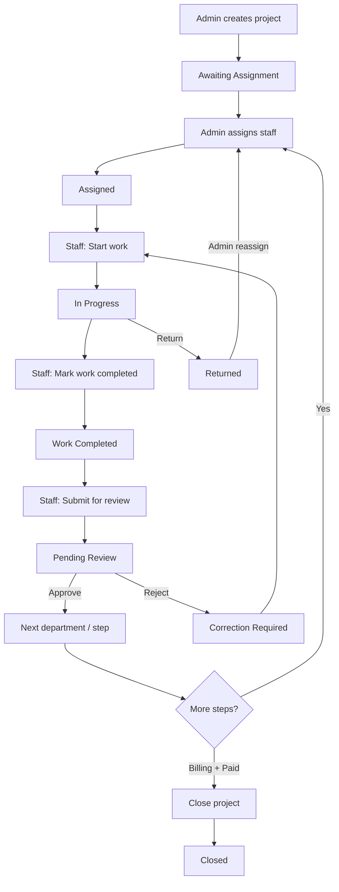

# Project Create, Details & Staff Workflow

End-to-end guide for creating projects, using project detail pages, and completing work as staff (employees).

---

## Routes

| Role | List / Home | Detail |
|------|-------------|--------|
| Super Admin / Admin | `/admin/projects` | `/admin/projects/[id]` |
| Staff (employee) | `/staff` (queue) · `/staff/projects` | `/staff/projects/[id]` |
| Billing Staff | `/admin/projects` (Billing section only) | Billing-focused detail view |

There is no `/employee` portal — employees use **`/staff`**.

---

## 1. Create Project (Admin)

**Who:** Super Admin or Admin  
**Action:** `createProject` in `lib/actions.ts`

### Entry points

1. `/admin/projects` → **New Project** (`components/project-dialog.tsx`)
2. `/admin/clients` → **Register client + project** (`components/register-client-project-dialog.tsx`) — creates client, then calls `createProject`

### Steps

1. Open create dialog (New Project requires at least one client).
2. Fill **Project Details**:
   - Project name (required)
   - Refer name (optional)
   - Client (required)
   - Location, Type, Drawing number
3. Choose **Project Package**:
   - **Full Project** — all active core services
   - **Custom Services** — pick only what the client needs
4. For Residential + Custom, optional property fields may appear (building number, permit number, etc.).
5. Select **Required documents** (auto-suggested from selected services; can deselect).
6. Set priority, due date, and amount.
7. Submit.

### What happens on create

- Auto-generates project code (`PROJECT-YYYY-####`) and invoice number (`INV-YYYY-####`).
- Initial status: **`Awaiting Assignment`**
- Initial section: **`Planning & Design`**
- Seeds workflow via `seedProjectWorkflow`:
  - **Planning** step → for each selected service: **Service work + Admin Review** → **Billing**
  - Document checklist items for those services
- Seeds empty KMAP floor rows.
- Writes status history: `New` → `Awaiting Assignment`.
- Opens project print/PDF after success.

### Key files

- `components/project-dialog.tsx` — create UI
- `components/register-client-project-dialog.tsx` — combined client + project registration
- `lib/actions.ts` → `createProject`
- `lib/workflow-db.ts` → `seedProjectWorkflow`

---

## 2. Project Details — Admin

**Where:** `/admin/projects/[id]`  
**File:** `app/admin/projects/[id]/page.tsx`

### Layout

1. **Header** — name, code, status / priority / payment badges, amount, progress, due date, invoice, print button
2. **Client Information** — name, phone, email, address
3. **Workflow Timeline** — full pipeline (`WorkflowTimeline`)
4. **Sidebar**
   - Project info (type, location, department, stage, drawing/edgebook/refer)
   - Assigned staff / team
   - Status + review note
5. **Main column**
   - **Department Progress** — `ProjectWorkflowPanel` (admin actions)
   - Drawing number panel
   - KMAP areas panel
   - Tabs: Documents checklist · Files · Billing
6. **Right column** — activity feed, comments, recent notifications

### Admin workflow actions (`ProjectWorkflowPanel`)

| Action | When | Result |
|--------|------|--------|
| **Assign staff / team** | Active work step (not during review) | Status → `Assigned`; staff notified |
| **Approve & assign next** | Status = `Pending Review` | Completes review; activates next work step |
| **Reject — correction required** | Status = `Pending Review` | Status → `Correction Required`; feedback note |
| **Reassign** | Status = `Returned` | Reassigns returned project to section staff |
| **Move department** | Anytime (override) | Moves section; optional assignee |
| **Update status** | Anytime | Manual status + note in history |
| **Close project** | Billing step + payment = `Paid` | Status → `Closed` |

---

## 3. Project Details — Staff (Employee)

**Where:** `/staff/projects/[id]`  
**File:** `app/staff/projects/[id]/page.tsx`

### Access rules (`lib/project-access.ts`)

- Staff can open a project if they **own** it (primary or site assignee) **or** previously contributed (status/return history).
- **Can edit** only when assigned and status is one of:  
  `Assigned`, `In Progress`, `Work Completed`, `Correction Required`, `Waiting for Documents`, `New`, `Awaiting Assignment`
- Otherwise the page is **view-only** (returned / past / submitted).

### Staff portals

| Page | Purpose |
|------|---------|
| `/staff` | Home — assigned work, KPIs, department queue (awaiting assignment for their roles) |
| `/staff/projects` | **Active** (owned, not Closed/Completed/Returned) · **Returned** · **Submitted & past** |

### Staff detail sections

1. Header — name, status, priority, section, progress
2. **Actions** (if editable) or **Current status** (read-only) — `ProjectWorkflowPanel`
3. Your work summary (returns / status entries) when view-only
4. Drawing number (Planning Staff can edit when project is in Planning & Design)
5. KMAP areas
6. Tabs: Checklist · Files · History

### Completing project details (while working)

Staff fill operational details on the same page before submitting:

- Document checklist (mark filed)
- Drawing number (Planning Staff, Planning & Design)
- KMAP floor areas
- Project files

These are **not hard gates** — `markWorkComplete` / `submitForReview` do not require checklist or KMAP to be finished.

### Staff complete workflow

```
Assigned
   ↓  Start work
In Progress  (+ checklist / KMAP / files / drawing as needed)
   ↓  Mark work completed
Work Completed
   ↓  Submit for admin review
Pending Review  →  (Admin approves / rejects)
```

| Button | Status required | What it does |
|--------|-----------------|--------------|
| **Start work** | `Assigned` or `Correction Required` | Status → `In Progress` |
| **Mark work completed** | `Assigned` / `In Progress` / `Correction Required` | Status → `Work Completed`; notifies office admins |
| **Submit for admin review** | `Work Completed` or `In Progress` | Completes current step; moves to next `admin_review` step; status → `Pending Review` |
| **Return project** | While editable | Status → `Returned` with reason + notes; back to office |

### Return reasons

Missing Documents · Incorrect Information · Client Approval Pending · Needs Revision · Out of Scope · Other

---

## 4. Full lifecycle (create → complete)



### Pipeline overview

Workflow is **service-based**, not a fixed 10-stage list:

```
Planning → [Service work → Admin Review] × each selected service → Billing → Closed
```

High-level department pipeline (for timeline UI):

1. Planning → Admin Review  
2. Building Permit → Admin Review  
3. 3D & Interior → Admin Review  
4. Estimation → Admin Review  
5. Billing → Completed / Closed  

Exact steps on a project depend on **selected services** at create time (full vs custom package).

### Completion gates (enforced by server actions)

| Gate | Criteria |
|------|----------|
| Start work | Status `Assigned` or `Correction Required` |
| Mark work complete | Active work step; status Assigned / In Progress / Correction Required |
| Submit for review | Active work step; status Work Completed / In Progress / Assigned |
| Approve review | Super Admin; status `Pending Review`; active review step |
| Close project | Super Admin; billing step; `payment_status === "Paid"` when amount > 0 |

### Status reference

| Status | Meaning |
|--------|---------|
| `New` / `Awaiting Assignment` | Created; waiting for staff |
| `Assigned` | Staff assigned to current step |
| `In Progress` | Staff started work |
| `Work Completed` | Staff finished step; may still submit review |
| `Pending Review` | Waiting for admin approval |
| `Correction Required` | Admin rejected; staff must fix |
| `Returned` | Staff sent back to office |
| `Waiting for *` / `On Hold` | Manual hold states |
| `Completed` / `Closed` | Finished |
| `Cancelled` | Cancelled |

---

## 5. Detail panels (both portals)

| Panel | Purpose | Component |
|-------|---------|-----------|
| Workflow | Assign, advance, review, return | `project-workflow-panel.tsx` |
| Documents / Checklist | Service-based required docs | `project-checklist.tsx` |
| Files | Project file references | `project-files-panel.tsx` |
| Drawing number | Planning drawing no. | `project-drawing-number-panel.tsx` |
| KMAP | Floor / area entries | `project-kmap-panel.tsx` |
| Billing / Payments | Amounts & payments (admin) | `project-payments-panel.tsx` |
| Activity / History | Status & return timeline | `project-activity-feed.tsx` / `project-history-panel.tsx` |

---

## 6. Key source files

```
app/admin/projects/page.tsx          # Project list + New Project
app/admin/projects/[id]/page.tsx     # Admin project details
app/admin/clients/page.tsx           # Register client + project
app/staff/page.tsx                   # Staff home / department queue
app/staff/projects/page.tsx          # Employee project list
app/staff/projects/[id]/page.tsx     # Employee project details
components/project-dialog.tsx        # Create form
components/register-client-project-dialog.tsx
components/project-workflow-panel.tsx # Admin + staff actions
lib/actions.ts                       # createProject, assign, startWork, markWorkComplete, submitForReview, …
lib/project-access.ts                # Who can view / edit
lib/workflow.ts / lib/workflow-db.ts # Step building + seed/activate
lib/constants.ts                     # Statuses, sections, pipeline
```

---

## Quick reference — who does what

| Step | Actor |
|------|--------|
| Create project + pick services/docs | Admin / Super Admin |
| Assign staff to current step | Super Admin |
| Start work / complete / submit review | Staff (assignee) |
| Approve or reject review | Super Admin |
| Return with missing info | Staff |
| Reassign returned project | Super Admin |
| Record payments & close | Billing / Super Admin |
